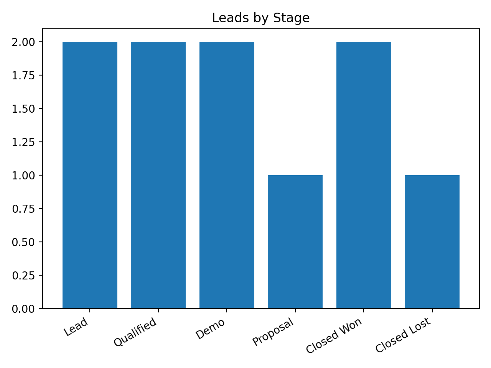
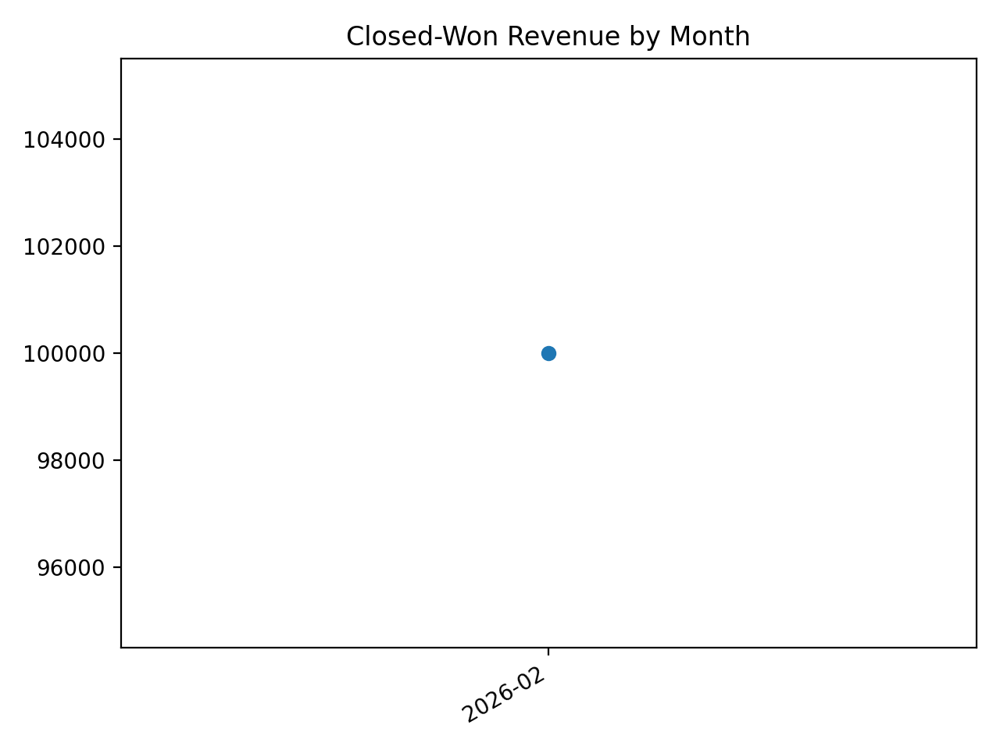
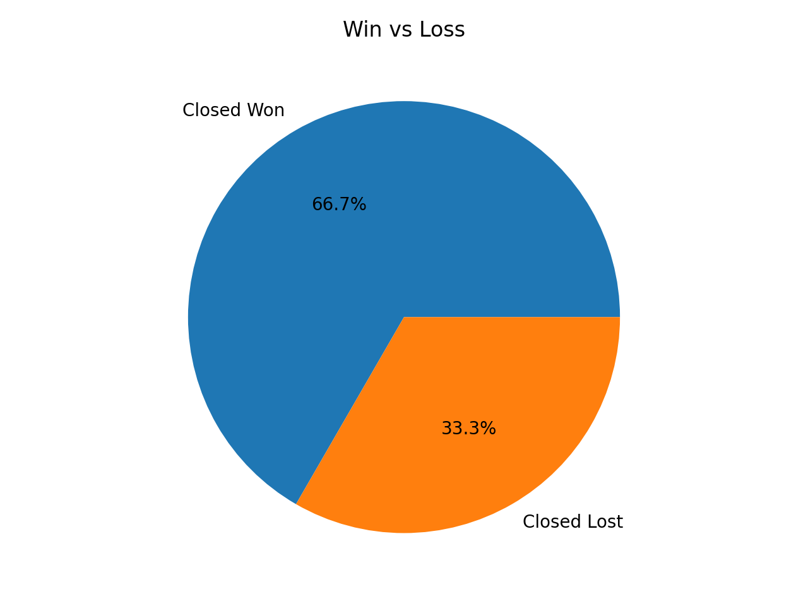

# Sales Pipeline Analyzer

This project analyzes a sales pipeline dataset and generates useful sales insights using Python.

The script processes a CSV file containing deal information and produces charts showing:

- Number of deals in each stage
- Win vs Loss ratio
- Monthly revenue from closed deals

---

## Project Structure

sales-pipeline-analyzer

data/ → sample dataset  
reports/ → generated charts  
src/ → main python script  
README.md → project documentation  
requirements.txt → python dependencies  

---

## Input Data

The project expects a CSV file with columns like:

lead_id  
created_date  
stage  
deal_value  
close_date  

Example sales stages:

Lead  
Qualified  
Demo  
Proposal  
Closed Won  
Closed Lost  

---

## How to Run the Project

### 1 Install dependencies

```
pip install -r requirements.txt
```

### 2 Run the script

```
python src/main.py
```

---

## Output

After running the script, the following charts will be generated inside the **reports** folder:

- Stage distribution chart
- Closed won revenue by month
- Win vs Loss pie chart

These charts help visualize sales performance and pipeline health.

---

## Tech Used

Python  
Pandas  
Matplotlib  

# Sales Pipeline Analyzer

This project analyzes a sales pipeline dataset and generates useful sales insights using Python.

The script processes a CSV file containing deal information and produces charts showing:

- Number of deals in each stage
- Win vs Loss ratio
- Monthly revenue from closed deals

---

## Project Structure

sales-pipeline-analyzer

data/ → sample dataset  
reports/ → generated charts  
src/ → main python script  
README.md → project documentation  
requirements.txt → python dependencies  

---

## Input Data

The project expects a CSV file with columns like:

lead_id  
created_date  
stage  
deal_value  
close_date  

Example sales stages:

Lead  
Qualified  
Demo  
Proposal  
Closed Won  
Closed Lost  

---

## How to Run the Project

### 1 Install dependencies

```
pip install -r requirements.txt
```

### 2 Run the script

```
python src/main.py
```

---

## Output

After running the script, the following charts will be generated inside the **reports** folder:

- Stage distribution chart
- Closed won revenue by month
- Win vs Loss pie chart

These charts help visualize sales performance and pipeline health.

---

## Tech Used

Python  
Pandas  
Matplotlib  

## Charts

### Deals by Stage


### Revenue by Month (Closed Won)


### Win vs Loss
